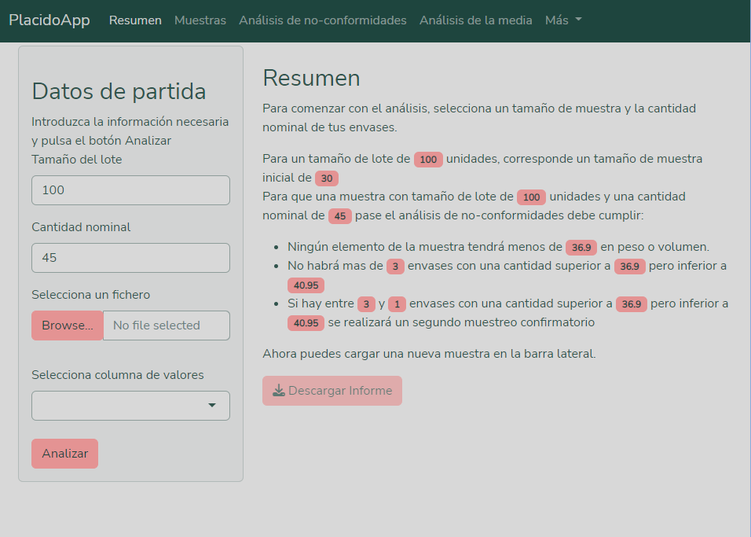
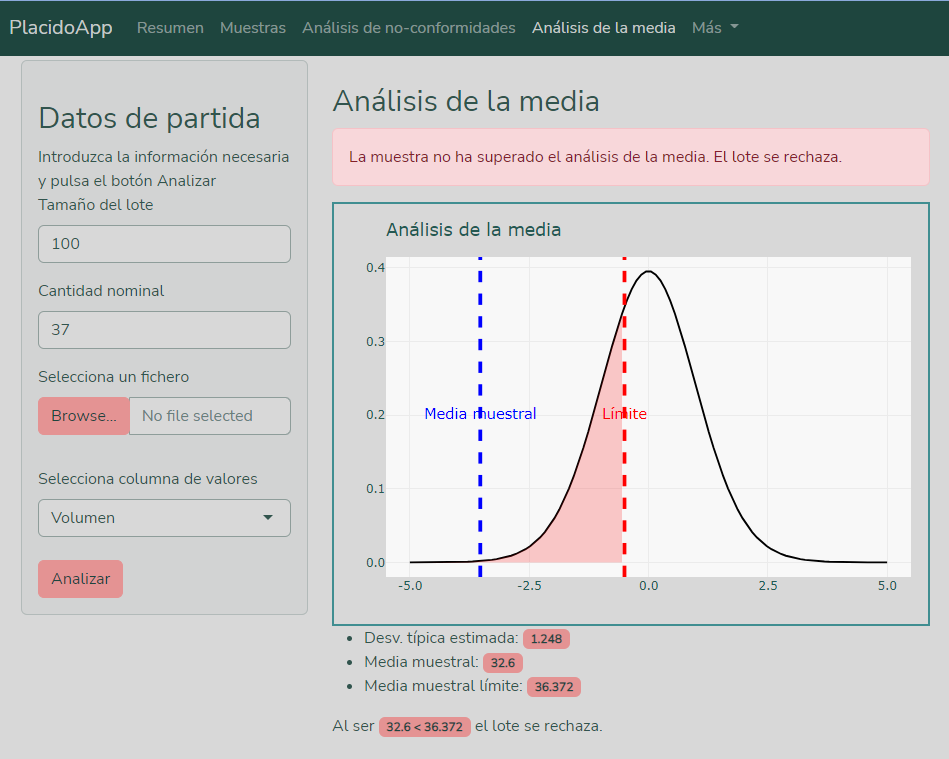

# Introducción

Esta aplicación Shiny implementa los procesos del Real Decreto 1801/2008, de 3 de noviembre, para establecer normas relativas a las cantidades nominales para productos envasados y al control de su contenido efectivo.

# Uso de la aplicación

En la barra superior de la aplicación, podrás navegar por las diferentes páginas. En la barra lateral, puedes introducir los datos necesarios para la aplicación.

Para comenzar introduce el tamaño del lote que deseas analizar y la cantidad nominal de tus envases. En la pestaña resumen podrás ver el tamaño de la muestra que necesitas tomar.

Una vez que hayas tomado la muestra, almacena los datos en un fichero csv y cárgalos en la aplicación. Si todo ha ido bien podrás explorar tu muestra en la pestaña "Muestas".

Ahora selecciona la columna de la muestra que corresponden a los valores de las mediciones. En el desplegable solo aparecerán las columnas que contengan exclusivamente datos numéricos.

Ya estás listo para darle al botón "Analizar". Después de hacerlo, podrás explorar los resultados en las pestañas de la aplicación.

Si el resultado del análisis es inconcluyente, aparecerán dos nuevos inputs en la barra lateral, carga una nueva muestra como hiciste antes y vuelve a usar el botón "Analizar".

# Páginas de la aplicación

## Resumen

La página de Resumen te guía paso a paso por el proceso de análisis. Aquí podrás ver un resumen de los resultados, además, la página se irá actualizando según introduzcas los inputs en la barra lateral para guiarte en el proceso.

## Muestras

En esta página podrás explorar las muestras que has introducido. La columna sombreada será la que has seleccionado como columna de valores en los inputs.

## Análisis de no-conformidades

En esta página, se informa de los resultados del análisis de no-conformidades. Puedes ver un gráfico que representa estos resultados, así como explorar la tabla con los datos de la muestra analizada además de un pequeño resumen de las no-conformidades encontradas.

Si tu muestra requiere un segundo análisis, esta página se actualizará con los resultados de éste una vez introducida la segunda muestra y reejecutado el análisis.

## Análisis de la media

Esta página muestra los resultados del análisis de la media. Al igual que en la página de Análisis de no-conformidades, aquí puedes ver un gráfico representativo de estos resultados.

## Sección Más

### Datos de ejemplo

Esta página te permite cargar datos de muestra en la aplicación. Esto puede ser útil para familiarizarte con la aplicación y entender cómo funciona antes de introducir tus propios datos.

### Ajustes visuales

La página de Ajustes visuales te permite cambiar el tema visual de la aplicación. Puedes seleccionar entre varios temas predefinidos para personalizar la apariencia de la aplicación según tus preferencias.

### Más información

La página Más información contiene información adicional sobre la aplicación y los autores. Si tienes alguna pregunta sobre la aplicación o si deseas saber más sobre quiénes la han creado, puedes encontrar esta información aquí.
